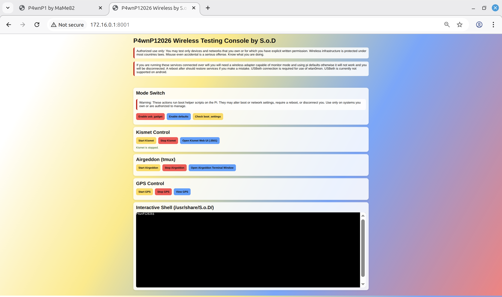
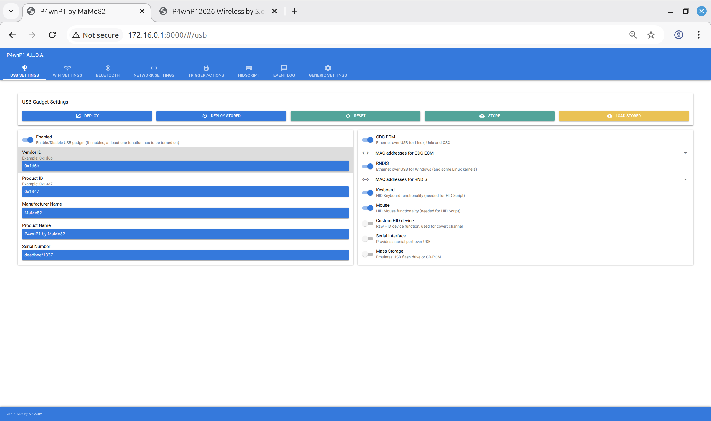
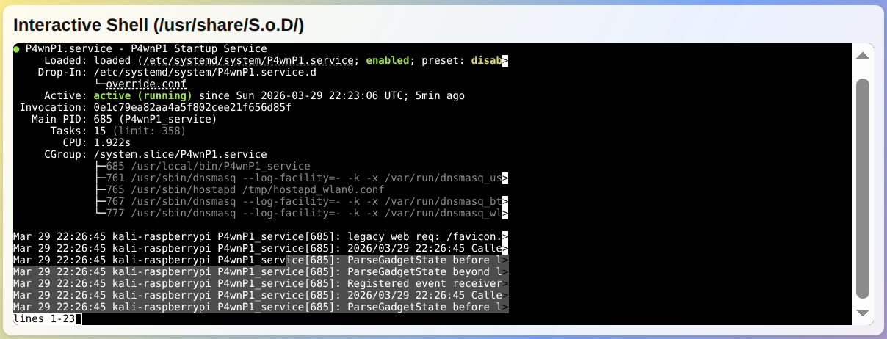
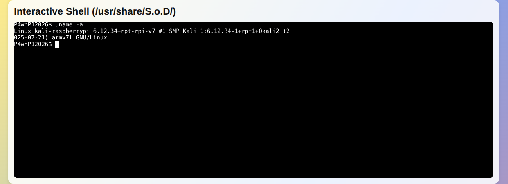
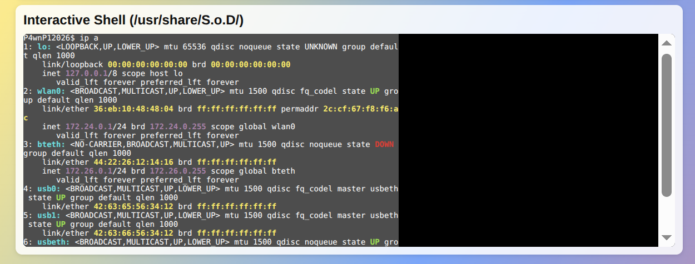

# P4wnP1 2026 (by S.o.D.)

**P4wnP1 2026** is a Go web control panel aimed at Raspberry Pi Zero 2 W workflows in the **P4wnP1 / A.L.O.A** tradition. It packages a small HTTP UI, service helpers, and interactive terminals to support **education and authorized security testing only**.

This project is a more legal and practical implementation of an idea people have asked about for years:

> **“Is there a P4wnagotchi-style P4wnP1, and how would I do that?”**

While other projects may take a more automated approach, those can raise legal and ethical issues when used to capture traffic without explicit authorization. This tool is designed to support **selecting the devices and targets you are explicitly permitted to test**.

**Use only where you have explicit permission and comply with local law.**

---

## Screenshots / Diagrams







---

## Overview / Assumptions

This stack assumes you understand the original P4wnP1 model:

- **USB Ethernet** to the Pi for stable management access
- **Monitor mode on `wlan0mon`** for capture-oriented tooling
- **Boot profiles** (`usb_gadget` vs `pi_defaults`) that pair with your choice of onboard vs external Wi‑Fi adapter 

### Important: avoid locking yourself out
If you rely on Wi‑Fi for admin access, avoid putting `wlan0` into monitor mode (or otherwise disrupting it), as you can lock yourself out. A reboot usually restores service.

---

## Ports (Quick Reference)
- **Original P4wnP1:** `:8000`
- **P4wnP12026 Web UI:** `:8001`
- **Kismet:** `:2501` (the helper may redirect your browser here)
- **GPS (optional/common pattern):** UDP input on `:9999` (adjust to match your `gpsd` and client configuration)

---

## Security Notes (Read First)

Images and profiles in this family often ship with default Wi‑Fi and P4wnP1 passkeys, as well as default credentials like:

- `root:toor`
- `kali:kali`

Treat defaults as insecure. **Change passwords and keys before any real deployment.**

---

## Operations

### Web UI
- The UI listens on port **8001**.
- The bind address depends on your network setup (for example, binding to `0.0.0.0` vs `127.0.0.1`, and which interface you use for management such as USB Ethernet).

### Boot Profile
Switch between **`usb_gadget`** and **`pi_defaults`** from the UI when you need gadget-style USB networking vs standard Pi defaults. Confirm prompts and expect a **reboot** when the workflow requires it.

### Kismet
Start/stop Kismet from the UI. The helper redirects the browser to Kismet on port **2501** when appropriate.

### Monitor Mode
Kismet and Airgeddon workflows expect **`wlan0mon`**. For stable control while using monitor mode, **USB Ethernet** is the supported management path.

> Note: USB Ethernet is not supported on Android for this workflow.

### GPS
GPS tooling is integrated with the host’s `gpsd` setup.

- The UI start/stop actions drive the bundled `gpsd` scripts under `gpsd/scripts/`.
- When deployed as documented in the tree, paths are rooted under something like `/root/P4wnP12026/...`.

One common pattern is feeding GPS to `gpsd` via a **UDP listener on port 9999** (adjust to match your `gpsd` / client configuration).

### Interactive Sessions / Terminals
- **Airgeddon** runs inside **tmux** over a web PTY; tmux prefix keys and shortcuts behave like a normal terminal.
- A second shell session is rooted at **`/usr/share/S.O.D/`** for local scripts and tooling.
- Terminal access is provided via WebSocket PTYs.

---

## USB Dongle Usage

A USB dongle can be used to power and transfer data while the device is configured as a `usb_gadget`.

To use USB as **power-only**, the data connection needs to be broken. This was tested by blocking the data pins with an insulator (e.g., insulating tape/film). After researching a hardware device that would provide a physical “data kill/activation” switch, no reasonably sourceable option was found.

If someone creates a free/open-source project for:

- a dongle with a working **data switch**, and
- an optional **3D-printed case** design

…it would be appreciated.

---

## Credits / License

- **P4wnP1 / A.L.O.A** ecosystem and upstream ideas trace to **MaMe82** and the broader **P4wnP1** community.
- This repository is a derivative control layer and filesystem mirror, not a replacement for upstream firmware documentation.
- Respect the **licenses** of bundled upstream assets under `vendor/`, `usr/`, and other third-party trees when redistributing.

Upstream lineage reference:
- RoganDawes/P4wnP1: https://github.com/RoganDawes/P4wnP1

---

## Build

Cross-compile for Raspberry Pi (ARMv7) with vendored modules:

```bash
go mod tidy
go mod vendor
env \
  GOOS=linux \
  GOARCH=arm \
  GOARM=7 \
  GOFLAGS=-mod=vendor \
  go build -o ./build/P4wnP12026 ./cmd/P4wnP12026
```

The HTML/CSS/JS UI is embedded in the binary (`internal/webassets`), so you can run the binary from any working directory (you do not need a separate `web/` folder beside it):

```bash
./build/P4wnP12026
```

---

## Image Build Notes

This image is based on packages sourced from:

- https://github.com/NightRang3r/P4wnP1-A.L.O.A.-Payloads
- A carefully installed P4wnP1_aloa image layered onto a Kali ARMHF image:
  - https://old.kali.org/arm-images/kali-2025.3/kali-linux-2025.3-raspberry-pi-zero-2-w-armhf.img.xz

Additional upstream components were taken from:

- https://github.com/RoganDawes/P4wnP1_aloa.git

### High-level build process (summary)

1. Start from `kali-linux-2025.3-raspberry-pi-zero-2-w-armhf.img.xz`.
2. Install/merge the most recently updated P4wnP1_aloa payload packages available from the sources above.
3. Rebuild:
   - `P4wnP1_service`
   - `P4wnP1_cli`
4. Change default DHCP lease times from **5 minutes** to **24 hours**.
5. Move the file structure and supporting files into the correct locations.
6. Build and install the `P4wnP12026` service.

### Storage requirements
With the older packages layered on top of the Kali ARMHF image, the result takes up most of a 16GB microSD.

- **For best results, use a 32GB microSD.**

### Version selection rationale
These images were chosen because:

- The P4wnP1_aloa image was the most recently updated at the time.
- The `kali-linux-2025.3-raspberry-pi-zero-2-w-armhf.img.xz` image is ARMHF and (in testing the) does **not** exhibit the same Kismet/Airgeddon SSID issues observed with:
  - `kali-linux-2026.1-raspberry-pi-zero-2-w-armhf.img.xz` these issues where observed 2026-02-15 and may have been fixed.
